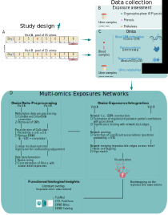

<style>
#main-img-left, #main-img-center, #main-img-right {
 width: 35%;
}
</style>

<style>
.main_bottom {
 background-image: none;
 background-color: #FFFFFF;
}
</style>

<style>
.section h1 {
  font-size: 55px;
}
</style>

<style>
.section h2 {
  font-size: 40px;
}
</style>

```{r setup, include=FALSE}
knitr::opts_chunk$set(echo = FALSE, include = TRUE, 
                      tidy = FALSE, 
                      message = FALSE, warning = FALSE, 
                      fig.align = 'center', out.width = "100%")
```

<br>

# Background & Objectives

* Individuals are exposed to multiple environmental pollutants with endocrine disrupting activity (endocrine disruptors, EDCs)
* Few studies have integrated biomarkers of exposure to EDCs and multi-omics
* We aimed to identify multi-omic signatures associated with childhood exposure to non-persistent EDCs using a network approach

<br>

# Methods

* Data: HELIX (Human Early-Life Exposome) Child Panel Study ($N_A = 140$, $N_B = 143$)

<br>



```{r, echo=FALSE}
#knitr::include_graphics(paste0(getwd(), "/images/study_design.svg"))
```

<!-- * We developed Gaussian Graphical Models (GGMs) based on shrinkage estimates of pairwise partial correlations between EDCs and molecular features in each week -->
<!-- * The obtained networks for the two visits were merged in order to identify reproducible associations -->
<!-- * We corroborated the associations between EDCs and omic features with -->
<!--   * Manual literature review (PubMed) -->
<!--   * Adverse health effects associated with the EDCs (PubChem) -->
<!--   * Traits associated with the CpG sites (EWAS Atlas) -->
<!--   * Genes mapped to the CpG sites (EWAS Atlas, EWAS Catalog) -->

<br>

<br>

<br>

# Results

<!-- ## Study population -->

<!-- |**Characteristic**        |   **Visit A**, N = 140   |   **Visit B**, N = 143   | -->
<!-- |:-------------------------|:------------------:|:------------------:| -->
<!-- |__Cohort__                |                    |                    | -->
<!-- |BIB                       |      27 (19%)      |      27 (19%)      | -->
<!-- |EDEN                      |      23 (16%)      |      23 (16%)      | -->
<!-- |KANC                      |      27 (19%)      |      26 (18%)      | -->
<!-- |RHEA                      |      29 (21%)      |      29 (20%)      | -->
<!-- |SAB                       |      34 (24%)      |      38 (27%)      | -->
<!-- |__Sex__                   |                    |                    | -->
<!-- |female                    |      60 (43%)      |      61 (43%)      | -->
<!-- |male                      |      80 (57%)      |      82 (57%)      | -->
<!-- |__Age__                   | 6.97 (6.44, 8.85)  | 7.55 (6.93, 9.62)  | -->
<!-- |__Ethnicity__             |                    |                    | -->
<!-- |Caucasian                 |     129 (92%)      |     132 (92%)      | -->
<!-- |Pakistani                 |     10 (7.1%)      |     10 (7.0%)      | -->
<!-- |Other                     |      1 (0.7%)      |      1 (0.7%)      | -->
<!-- |__zBMI__                  | 0.28 (-0.34, 1.09) | 0.26 (-0.34, 1.09) | -->
<!-- |__Season__                |                    |                    | -->
<!-- |autumn                    |      35 (25%)      |      38 (27%)      | -->
<!-- |spring                    |      50 (36%)      |      49 (34%)      | -->
<!-- |summer                    |      20 (14%)      |      8 (5.6%)      | -->
<!-- |winter                    |      35 (25%)      |      48 (34%)      | -->

## Merged network: reproducible associations across visits


```{r, echo=FALSE}
#knitr::include_graphics(paste0(getwd(), "/images/networks_main.svg"))
```

* The process of network merging led to the exclusion of a significant number of edges, maintaining 950 edges compared to 4,083 and 4,908 in networks A and B, respectively

| Chemical class | Compound | Omic layer | Omic feature | Median pcor | Literature review |
|:---:|:---:|:---:|:---:|:---:|:---:|
| OP pesticides | DEP | Serum metabolome | Serotonin | 0.052 | Exposure to pesticides and changes in the serotonergic system [@slotkin2008developmental; @judge2016mechanism; @sarrouilhe2021exposome] |
| Phenols | TRCS | Serum metabolome | Serotonin | -0.055 | Association between personal care products and serotonin [@houten2016changes] |
| Phthalates | oh-MiNP | Serum metabolome | Kynurenine | -0.056 | Mediating effect of quinolic acid  on exposure to phthalates and neurological disorders [@nassan2019high] |
| Phenols | TRCS | Proteome | Leptin | -0.066 | Effect of mixtures of phenols and parabens [@lee2022race] |

# Conclusions

* We employed an integrative method to investigate reproducible associations between non-persistent EDCs and multi-omic profiles in a child cohort
* Strengths: repeated pooled samples of urines; quantifiable measurements of the metabolome
* Limitations: relatively small sample size; residual confounding
* Some of these biological signatures point towards the potential biological effects of OP pesticides and phthalates on the nervous system

# References
